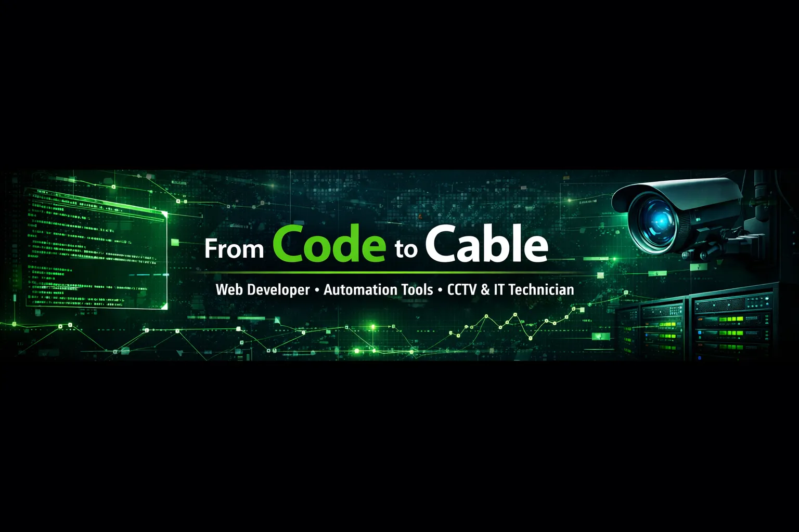

  

  

  <a href="https://myrul.dev">🌐 Portfolio</a> •
  <a href="mailto:myruldev@gmail.com">📧 Email</a> •
  <a href="https://wa.me/6289997779944">📱 WhatsApp</a>

---

## 🇮🇩 Tentang Saya
Saya adalah **Web Developer** yang juga aktif sebagai **Teknisi CCTV & IT**.  
Terbiasa bekerja di dua dunia: **pengembangan sistem digital** dan **implementasi teknis di lapangan**.

- Web Developer (Frontend & Backend)
- Automation tools & AI-assisted utilities
- Teknisi CCTV & IT (instalasi, maintenance, troubleshooting)
- Android & system optimization (Termux, Shizuku)
- Problem solver & fast learner

---

## 🇬🇧 About Me
I'm a **Web Developer** with hands-on experience as a **CCTV & IT Technician**.  
Comfortable working across **software development** and **real-world technical infrastructure**.

- Web Development (Frontend & Backend)
- Automation & internal tools
- CCTV & IT field operations
- Android & system optimization

---

## 🛠 Tech Stack
- HTML, CSS, JavaScript, PHP
- MySQL, Firebase, Google Apps Script
- Git, GitHub, Linux
- CCTV, Networking, IT Support

---

## 📌 Featured Projects
- Xiaomi Debloat Tool (No Root)
- Invoice Generator Web App
- Portfolio Website

---

## 🤝 Kontak
- Email: myruldev@gmail.com
- WhatsApp: +62 899-9777-9944
- Website: https://myrul.dev
