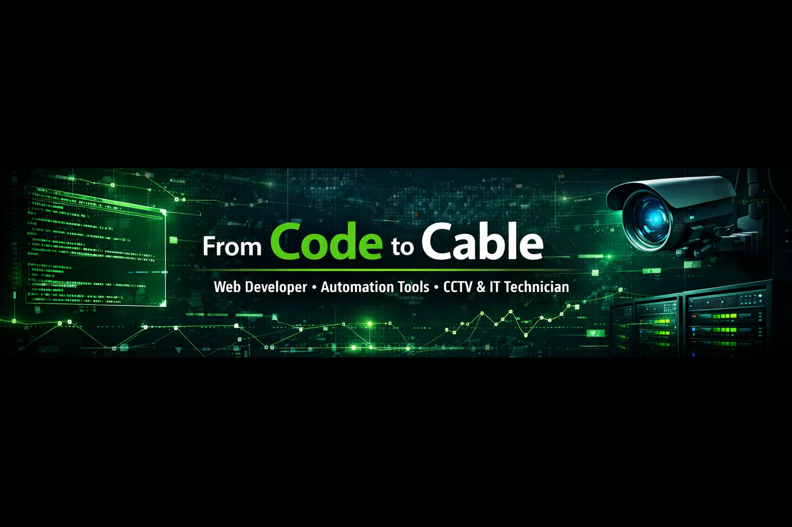

  

  

  
  
  

---

### 🧑‍🔧 Profil Profesional
Saya adalah **Teknisi CCTV & IT** yang fokus pada **pekerjaan lapangan**. Bagi saya, koding dan AI bukan cuma hobi, tapi **senjata utama** untuk mempercepat instalasi, otomasi monitoring, dan dokumentasi sistem yang presisi.

- 🛠 **Field Power**: Ahli instalasi IP Camera, Networking (LAN/WLAN), dan Troubleshooting NVR/DVR.
- ⚙ **Digital Logic**: Mengembangkan tools internal berbasis web dan script otomasi untuk efisiensi kerja lapangan.
- 📱 **Optimization**: Fokus pada sistem yang reliabel, kencang, dan mudah dimonitor.

---

### 🛠 Tech & Field Stack

| Field Expertise | Digital Tools |
| :--- | :--- |
|  |   |
|  |   |
|  |   |

---

### 📊 GitHub Stats

  
  

  

---

### 📌 Repositori Unggulan 
- 🍏 **[Myrul Store](https://github.com/myruldev/myrulstore)**: Platform digital ecommerce dengan kodingan "Buttery Smooth". <!-- [CEK INI] pastikan username repo benar -->
- ⚙ **Internal Monitoring Tools**: Script otomasi untuk pengecekan status IP Camera secara massal.
- 🌐 **Project Documentation**: Kumpulan skema jaringan dan konfigurasi sistem IT.

> *Coding is my supporting skill, Field Insight is my main power.*

---

### 🤝 Mari Terkoneksi
Jika Anda membutuhkan **Teknisi CCTV**, **IT Support**, atau **Automasi Sistem**, silakan hubungi kontak di atas. **Ready for Field Duty!** 🚀
